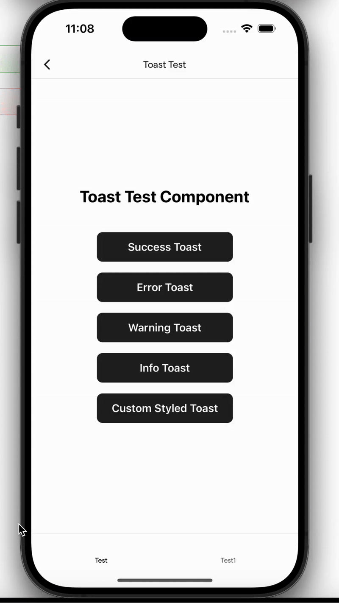
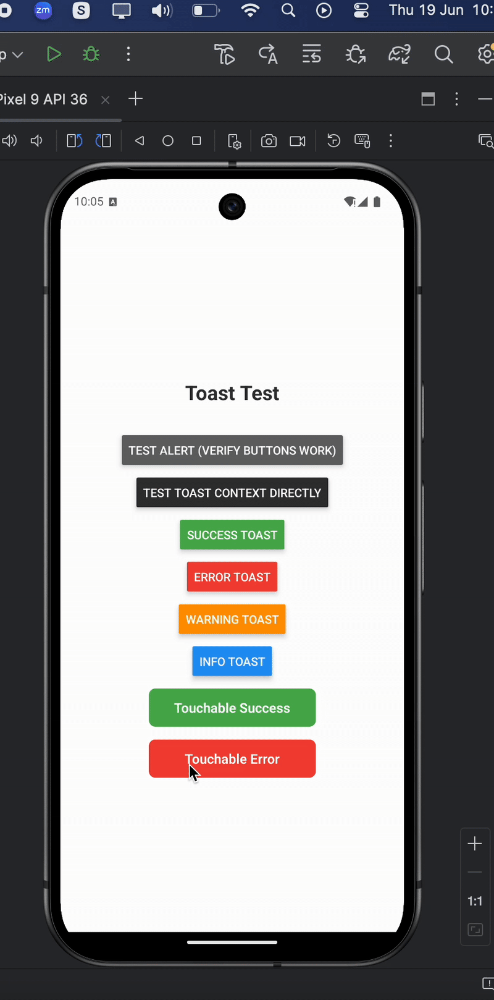

# 🚀 React Native Toastify Expo – Beautiful Toast Notifications for React Native & Expo

**react-native-toastify-expo** is a lightweight, customizable toast notification library built specifically for **React Native** apps using **Expo**. With cross-platform support, smooth animations, and full styling control, it's the easiest way to show success, error, or info toasts in your React Native project.

> 📦 Now available on [npm](https://www.npmjs.com/package/react-native-toastify-expo)

---

## 📱 Demo

### iOS  


### Android  


---

## ✨ Features

- 🎨 **Highly Customizable** – Control colors, icons, positions, durations, and styles
- 📱 **Expo & React Native Support** – Works seamlessly on both Android and iOS
- 🚀 **Lightweight** – No external dependencies
- ⚡ **Smooth Animations** – Clean UI transitions with animation support
- 🛠️ **TypeScript Support** – Full type definitions included
- 🎯 **Flexible Placement** – Position toasts on top or bottom
- 🔧 **Custom Toast Types** – Define your own toast variants

---

## 📦 Installation


```bash
npm install react-native-toastify-expo
# or
yarn add react-native-toastify-expo
```

## Quick Start

1. Wrap your app with the ToastProvider:

```jsx
import React from 'react';
import { ToastProvider } from 'react-native-toastify-expo';

export default function App() {
  return (
    <ToastProvider>
      <YourApp />
    </ToastProvider>
  );
}
```

2. Use the useToast hook in your components:

```jsx
import React from 'react';
import { View, Button } from 'react-native';
import { useToast } from 'react-native-toastify-expo';

export const MyComponent = () => {
  const { showToast } = useToast();

  return (
    <View>
      <Button 
        title="Show Success Toast"
        onPress={() => showToast({
          message: 'Operation completed successfully!',
          type: 'success',
          duration: 3000,
          position: 'bottom'
        })}
      />
      <Button 
        title="Show Error Toast"
        onPress={() => showToast({
          message: 'Something went wrong!',
          type: 'error',
          duration: 5000,
          position: 'top'
        })}
      />
    </View>
  );
};
```

## Props

### Required Props

| Prop | Type | Description |
|------|------|-------------|
| `message` | `string` | The message to display in the toast |
| `type` | `ToastType` | Toast type: 'success', 'error', 'warning', 'info', or custom string |
| `duration` | `number` | Duration in milliseconds before auto-dismiss |
| `position` | `'top' \| 'bottom'` | Position of the toast on screen |

### Style Props

| Prop | Type | Description |
|------|------|-------------|
| `textStyle` | `object` | Custom styles for the message text |
| `containerStyle` | `object` | Custom styles for the toast container |

### Custom Toast Types

| Prop | Type | Description |
|------|------|-------------|
| `customToastTypes` | `Record<string, ToastTypeConfig>` | Custom toast type configurations |

## ToastTypeConfig Interface

```tsx
interface ToastTypeConfig {
  backgroundColor: string;  // Background color of the toast
  indicator: string;        // Icon/emoji to display
  iconColor: string;        // Color of the indicator
  textColor?: string;       // Color of the text (optional, defaults to iconColor)
}
```

## Examples

### Basic Usage

```jsx
import { useToast } from 'react-native-toastify-expo';

const MyComponent = () => {
  const { showToast } = useToast();

  const handleSuccess = () => {
    showToast({
      message: 'Data saved successfully!',
      type: 'success',
      duration: 3000,
      position: 'bottom'
    });
  };

  const handleError = () => {
    showToast({
      message: 'Failed to save data!',
      type: 'error',
      duration: 5000,
      position: 'top'
    });
  };

  const handleWarning = () => {
    showToast({
      message: 'Please check your input!',
      type: 'warning',
      duration: 4000,
      position: 'bottom'
    });
  };

  const handleInfo = () => {
    showToast({
      message: 'New update available!',
      type: 'info',
      duration: 3000,
      position: 'bottom'
    });
  };

  return (
    <View>
      <Button title="Success" onPress={handleSuccess} />
      <Button title="Error" onPress={handleError} />
      <Button title="Warning" onPress={handleWarning} />
      <Button title="Info" onPress={handleInfo} />
    </View>
  );
};
```

### Advanced Configuration

```jsx
const { showToast } = useToast();

// Custom duration and position
showToast({
  message: 'This toast will appear at the top for 5 seconds',
  type: 'info',
  duration: 5000,
  position: 'top'
});
```

### Custom Styling with textStyle and containerStyle

You can fully customize the appearance of your toasts using the `textStyle` and `containerStyle` props:

```jsx
const { showToast } = useToast();

// Custom styled toast with large text and rounded corners
showToast({
  message: 'Custom styled toast with large text and rounded corners!',
  type: 'info',
  duration: 4000,
  position: 'top',
  textStyle: {
    fontSize: 18,
    fontWeight: 'bold',
    textAlign: 'center',
    color: '#ffffff'
  },
  containerStyle: {
    borderRadius: 20,
    backgroundColor: '#9c27b0',
    padding: 20,
    marginHorizontal: 10
  }
});

// Toast with custom background and text styling
showToast({
  message: 'Toast with custom background and text styling!',
  type: 'success',
  duration: 5000,
  position: 'bottom',
  textStyle: {
    fontSize: 16,
    fontStyle: 'italic',
    textDecorationLine: 'underline',
    color: '#fff'
  },
  containerStyle: {
    backgroundColor: '#ff5722',
    borderRadius: 12,
    borderWidth: 2,
    borderColor: '#fff',
    shadowColor: '#000',
    shadowOffset: { width: 0, height: 4 },
    shadowOpacity: 0.3,
    shadowRadius: 6,
    elevation: 8
  }
});

// Minimal design toast
showToast({
  message: 'Minimal design toast',
  type: 'warning',
  duration: 3000,
  position: 'top',
  textStyle: {
    fontSize: 14,
    color: '#333'
  },
  containerStyle: {
    backgroundColor: '#fff',
    borderRadius: 4,
    padding: 12,
    borderLeftWidth: 4,
    borderLeftColor: '#ff9800'
  }
});
```

## Styling

The toast component uses React Native's StyleSheet for styling. You can customize the appearance by passing `textStyle` and `containerStyle` props.

### Default Styles

- **Background Colors:**
  - Success: `#4caf50`
  - Error: `#f44336`
  - Warning: `#ff9800`
  - Info: `#2196f3`
- **Text Color:** White
- **Border Radius:** 8px
- **Padding:** 15px
- **Shadow:** Subtle elevation/shadow for depth

### Custom Styling

You can override any default style by using the `textStyle` and `containerStyle` props:

- **`textStyle`**: Overrides the message text styling (fontSize, color, fontWeight, etc.)
- **`containerStyle`**: Overrides the toast container styling (backgroundColor, borderRadius, padding, etc.)

The custom styles are merged with the default styles, so you only need to specify the properties you want to change.

## Requirements

- React Native >= 0.60.0
- React >= 16.8.0

## License

MIT

## Contributing

1. Fork the repository
2. Create your feature branch (`git checkout -b feature/amazing-feature`)
3. Commit your changes (`git commit -m 'Add some amazing feature'`)
4. Push to the branch (`git push origin feature/amazing-feature`)
5. Open a Pull Request

## License

This project is licensed under the MIT License - see the LICENSE file for details.

## Support

If you encounter any issues or have questions, please open an issue on GitHub.